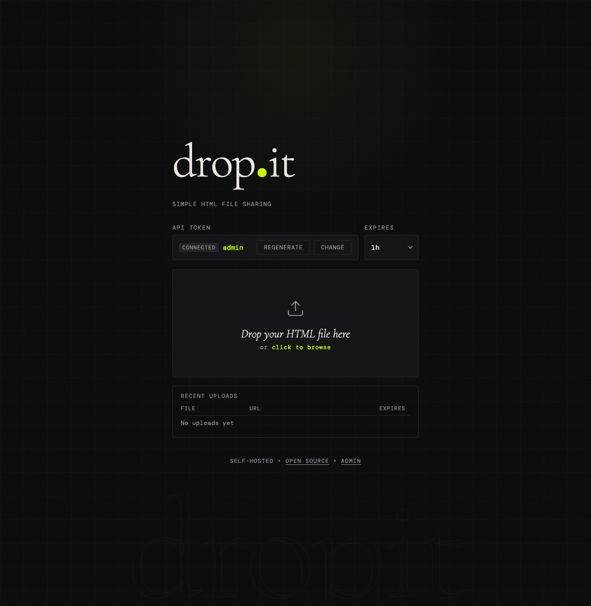
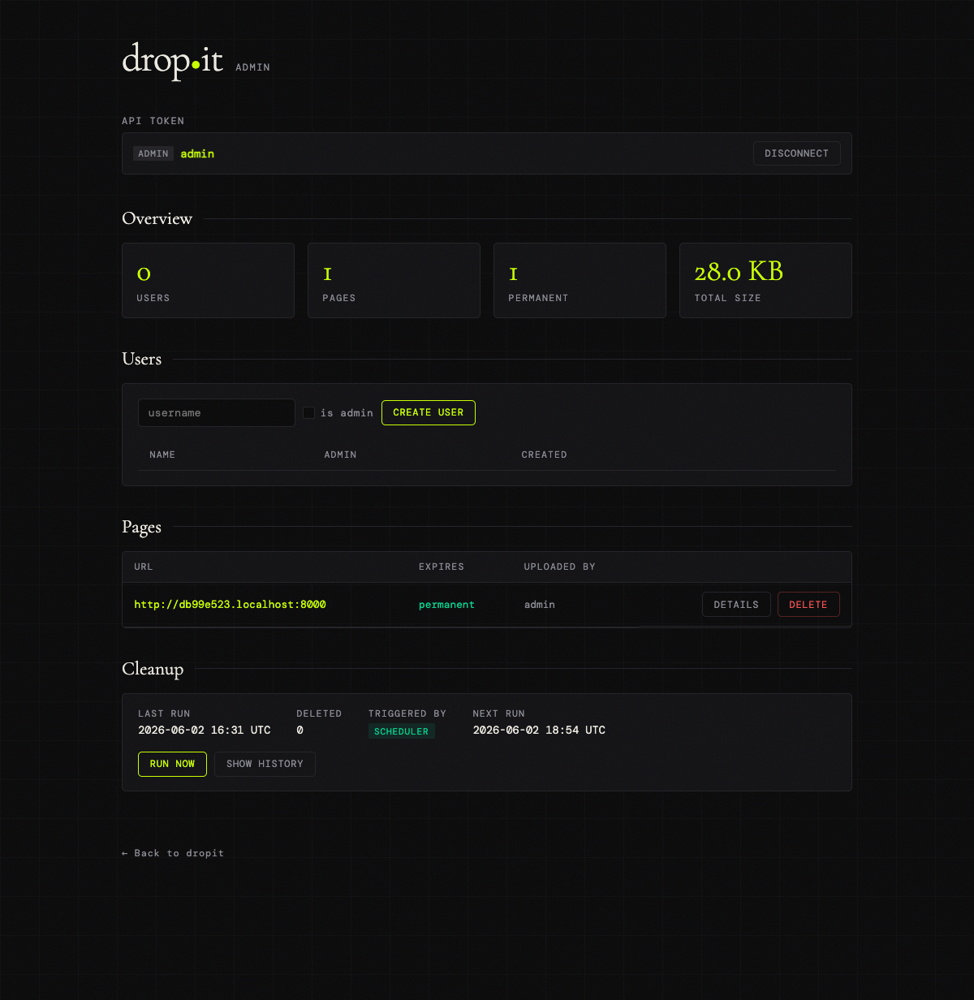

# drop•it

Self-hosted HTML file sharing. Upload an HTML file, get a short-lived public URL.

<p align="center">
  
  &nbsp;
  
</p>

## Quick start

```bash
cp .env.example .env        # edit UPLOAD_TOKENS and BASE_URL
just install                # create venv and install deps
just dev                    # run on http://localhost:8000
```

Open `http://localhost:8000` — enter your API token, drop an HTML file, copy the link.

## Admin panel

Visit `http://localhost:8000/admin` with your admin token to list and delete all uploaded pages.

Set `ADMIN_TOKEN` in your `.env` to enable it:
```bash
# Generate a secure token
just admin-token

# Add to .env
ADMIN_TOKEN=<generated-value>
```

The admin token also unlocks the `forever` TTL and bypasses the per-user TTL limit.

## Upload via API

```bash
curl -X POST http://localhost:8000/upload \
  -H "Authorization: Bearer tok_abc123" \
  -F "file=@page.html"
# {"url": "http://localhost:8000/p/a3f8c1d2", "expires_at": "..."}

# Custom TTL (1h, 6h, 24h, 48h, 7d — or "forever" with admin token)
curl -X POST "http://localhost:8000/upload?ttl=6h" \
  -H "Authorization: Bearer tok_abc123" \
  -F "file=@page.html"

# Permanent upload (admin token required)
curl -X POST "http://localhost:8000/upload?ttl=forever" \
  -H "Authorization: Bearer <admin-token>" \
  -F "file=@page.html"
```

## Claude Code integration

A [Claude Code skill](https://forgejo.patilla.es/patillacode/dotfiles/src/branch/main/dot_claude/skills/dropit/SKILL.md) is available for uploading HTML files directly from Claude Code sessions via `/dropit`. It handles file resolution, TTL selection, and upload in one step.

## Self-hosting

Pre-built images are published for **amd64** and **arm64** (Raspberry Pi 4/5):

| Registry | Image |
|---|---|
| Forgejo | `forgejo.patilla.es/patillacode/dropit:latest` |

Create a `compose.yml` on your server:

```yaml
services:
  dropit:
    image: forgejo.patilla.es/patillacode/dropit:latest
    ports:
      - "8000:8000"
    volumes:
      - ./data:/data
    environment:
      # At least one upload token — share it with whoever should be able to upload
      UPLOAD_TOKENS: alice:your-token-here
      # Admin token — generate with: openssl rand -hex 32
      ADMIN_TOKEN: your-admin-token-here
      # Your public URL — important for the share links in upload responses
      BASE_URL: http://your-server-ip:8000
      # Optional: allow permanent uploads (admin only)
      # ALLOWED_TTLS: 1h,6h,24h,48h,7d,forever
    restart: unless-stopped
```

```bash
docker compose up -d
```

Open `http://your-server-ip:8000`.

**Behind a reverse proxy** (nginx, Caddy, Traefik): remove the `ports` mapping, set `BASE_URL` to your public domain (e.g. `https://dropit.example.com`), and proxy to the container on port 8000.

**To update:**

```bash
docker compose pull && docker compose up -d
```

## Docker (local build)

```bash
# Build
docker build -t dropit .

# Run
docker run -p 8000:8000 \
  -e UPLOAD_TOKENS=alice:tok_abc123 \
  -e BASE_URL=http://localhost:8000 \
  -e ADMIN_TOKEN=your-admin-token \
  -v $(pwd)/data:/data \
  dropit

# Or with compose (uses .env file)
docker compose up
```

## Development

```bash
just test           # run test suite
just lint           # check with ruff
just fix            # auto-fix lint + format
just reset-db       # delete dev database (forces fresh schema)
just admin-token    # generate a random admin token
```

## Configuration

All settings via environment variables (see `.env.example`):

| Variable | Default | Description |
|---|---|---|
| `UPLOAD_TOKENS` | required | `name:token` pairs, comma-separated |
| `ADMIN_TOKEN` | — | Token for `/admin` panel; also allows `forever` TTL and bypasses `MAX_USER_TTL` |
| `ALLOWED_TTLS` | `1h,6h,24h,48h,7d` | Accepted TTL values; add `forever` to enable permanent uploads |
| `DEFAULT_TTL` | `24h` | TTL when not specified in upload request |
| `MAX_USER_TTL` | `24h` | Maximum TTL for non-admin tokens |
| `MAX_UPLOAD_SIZE` | `5242880` | Max upload size in bytes (5 MB) |
| `CLEANUP_INTERVAL_HOURS` | `1` | How often expired pages are purged |
| `DATA_DIR` | `./data` | Directory for SQLite DB and uploaded files |
| `BASE_URL` | `http://localhost:8000` | Base URL for generated share links |

## Release

Tag a version to trigger Docker build and push:

```bash
git tag v0.1.0
git push --tags
```

Requires `REGISTRY_TOKEN` secret set in Forgejo.
